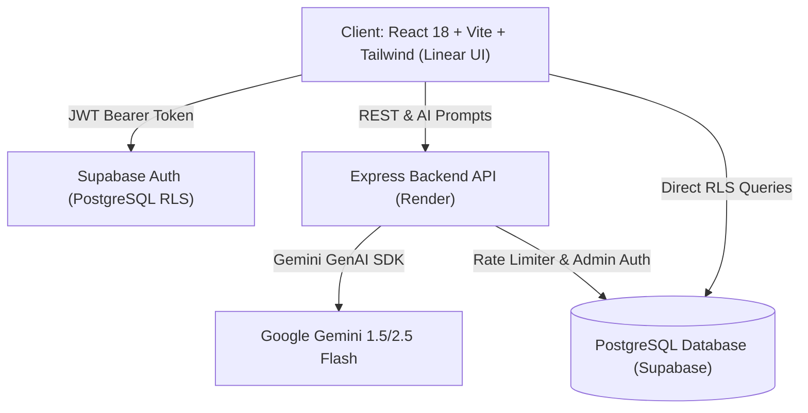

# ⚡ CareerOS — The Developer Operating System

> **A high-performance, Linear-grade engineering management platform engineered for software developers preparing for FAANG/tier-1 technical interviews.**


---

## 🌟 Overview & Architecture

CareerOS is built from the ground up as a **production-ready full-stack monorepo**, combining high-cadence habit tracking, spaced-repetition algorithmic mastery, customizable data schemas, and context-aware AI mentorship.



---

## 🛠️ Core Engineering Features

### 1. 🧠 DSA Spaced Repetition Engine
- **Algorithmic Review Intervals**: Automatically computes exponential revision dates based on the Ebbinghaus forgetting curve ($1\text{d} \to 3\text{d} \to 7\text{d} \to 14\text{d} \to 30\text{d}$).
- **Single-Click Review Action**: Bump topic confidence and recalculate future interview review dates instantly.
- **Dynamic Catalog**: Filter by LeetCode/GFG topic, difficulty, and confidence rating.

### 2. 📅 365-Day Study Momentum Matrix & Heatmap
- **Granular Session Logging**: Split study time between DSA, Web Development, and Core CS.
- **Dynamic Heatmap**: Interactive 52-week SVG activity matrix reflecting intensity and consistency.
- **Automated Streak Engine**: Real-time calculation of active and longest streaks.

### 3. 📚 Interactive Syllabi with Confetti Engine
- **Complete Roadmaps**: Comprehensive Full-Stack Web Development and Core Computer Science (OS, DBMS, Computer Networks, System Design) syllabi.
- **Milestone Celebrations**: Real-time particle confetti animations when completing all topics in a module.

### 4. ⚙️ Notion-Style Custom Schema Engine
- **Dynamic Column Builder**: Define custom entities with typed fields (`text`, `number`, `select`, `date`, `checkbox`, `url`).
- **Responsive Tables**: Live inline record insertion and JSONB persistence.

### 5. ✨ Google Gemini AI Socratic Copilot
- **Socratic Hints**: Explains algorithms through progressive hints without spoiling full solutions.
- **Mock Technical Interviewer**: Simulates Staff Engineer interviews on OS concurrency, indexing, and system design with scoring feedback.
- **Resume Impact Optimizer**: Transforms project descriptions into Google-style quantified metric bullet points.

---

## 📁 Repository Structure

```
Educational DASHBOARD/
├── client/                     # Frontend (React 18 + Vite + TypeScript + Tailwind)
│   ├── src/
│   │   ├── app/layout/         # AppShell, Sidebar, TopNavbar, CommandPalette
│   │   ├── features/           # dsa, curriculum, habits-logs, projects, custom-modules, ai-copilot
│   │   ├── services/           # Supabase & offline-fallback client services
│   │   ├── stores/             # Zustand state management
│   │   └── types/              # Domain TypeScript interfaces
│   ├── vercel.json             # Vercel SPA routing
│   └── tailwind.config.ts      # Linear/Raycast design tokens
│
├── server/                     # Backend (Node.js + Express + TypeScript)
│   ├── src/
│   │   ├── controllers/        # AI & Analytics route controllers
│   │   ├── middleware/         # Supabase JWT Auth & Express Rate Limiter
│   │   ├── services/           # Gemini AI & Analytics calculators
│   │   └── routes/             # RESTful API endpoints (/api/ai, /api/analytics, /api/health)
│   └── render.yaml             # Render deployment blueprint
│
├── supabase/
│   ├── migrations/             # Production PostgreSQL schema with Row-Level Security (RLS)
│   └── seed.sql                # Default DSA topics and Core CS roadmaps
│
├── vercel.json                 # Monorepo Vercel configuration
└── package.json                # Monorepo root workspace orchestration
```

---

## 🚀 Quickstart & Local Setup

### 1. Clone the repository
```bash
git clone https://github.com/tanishqkesarwani01/Dashboard.git
cd Dashboard
```

### 2. Install dependencies
```bash
npm install
```

### 3. Configure Environment Variables
Create `.env` files in both `client/` and `server/`:

**`client/.env`**:
```env
VITE_SUPABASE_URL=https://your-project.supabase.co
VITE_SUPABASE_ANON_KEY=sb_publishable_...
VITE_API_URL=http://localhost:5000
```

**`server/.env`**:
```env
PORT=5000
NODE_ENV=development
CLIENT_URL=http://localhost:5173
SUPABASE_URL=https://your-project.supabase.co
SUPABASE_SERVICE_ROLE_KEY=sb_secret_...
GEMINI_API_KEY=AIzaSy...
```

### 4. Run Development Servers
```bash
# Starts both frontend (port 5173) and backend (port 5000) concurrently
npm run dev
```

---

## ☁️ Cloud Deployment

### Backend Deployment (Render)
1. Link your GitHub repository to [Render](https://dashboard.render.com).
2. Create a new **Web Service** with:
   - **Root Directory**: `server`
   - **Build Command**: `npm install && npm run build`
   - **Start Command**: `npm run start`
3. Add environment variables: `NODE_ENV=production`, `PORT=10000`, `SUPABASE_URL`, `SUPABASE_SERVICE_ROLE_KEY`, `GEMINI_API_KEY`.

### Frontend Deployment (Vercel)
1. Link your GitHub repository to [Vercel](https://vercel.com/new).
2. Set **Root Directory** to `client` (or leave default root with our `vercel.json`).
3. Add environment variables: `VITE_SUPABASE_URL`, `VITE_SUPABASE_ANON_KEY`, `VITE_API_URL` (your live Render backend URL).
4. Click **Deploy**!

---

## 💼 Technical Interview Talking Points

- **Monorepo Architecture**: Clean separation between presentation (`client/`) and business logic (`server/`) with centralized TypeScript types.
- **Row-Level Security (RLS)**: Fine-grained PostgreSQL access control policies ensuring zero unauthorized multi-tenant data leaks.
- **Resilient Offline Fallback**: Data service layer transparently falls back to structured `localStorage` when network or database credentials are unavailable.
- **Defensive API Rate Limiting**: Express middleware protects external LLM quota from spam and brute-force exhaustion.

---

## 📄 License
MIT © 2026 Tanishq Kesarwani
